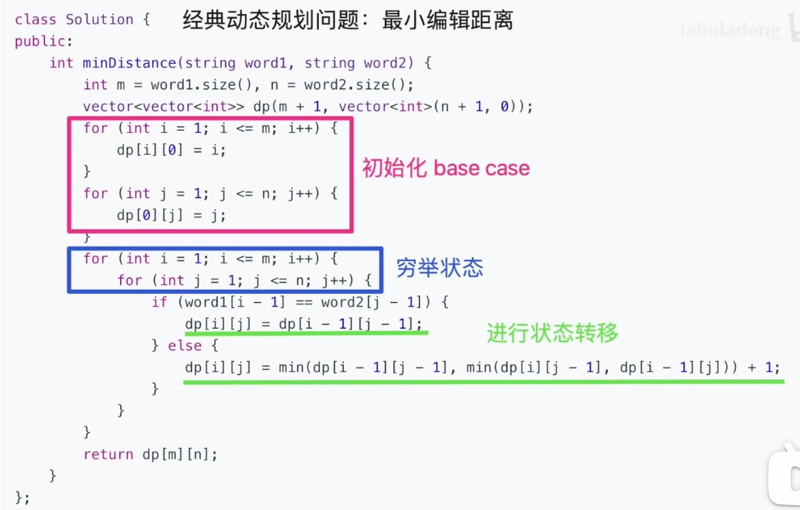

# 动态规划
把一个规模比较大的问题，分解为，较小规模的子问题。**动态规划的一般形式就是求最值**。

其核心就是**穷举**，因为要求最值，肯定要把所有可行的答案穷举出来，然后在里面找最值。


## 动态规划的特点

1. 重叠子问题：存在重复计算的问题
2. 状态转移方程（最关键）
3. 最优子结构


## 解题套路和代码框架
1. 明确「状态」
2. 明确「选择」
3. 明确 dp 函数/数组的定义
4. 明确 base case：就是初始化值

```python
# 初始化 base case
dp[0][0][...] = base

# 进行状态转移
for 状态1 in 状态1的所有取值：
    for 状态2 in 状态2的所有取值：
        for ...
            dp[状态1][状态2][...] = 求最值(选择1，选择2...)
```

套路代码都大致如下



### 斐波那契数列

严格来说不是正宗的动态规划问题， 因为他不是求最值问题，但是依然非常适合用这个算法


```javascript
function fibDp(n) {
  if (n < 1) return 0;
  if ([1, 2].includes(n)) return 1;

  const arr = new Array(n + 1).fill(0);
  arr[1] = arr[2] = 1;

  for (let i = 2; i <= n; i++) {
    arr[i] = arr[i - 1] + arr[i - 2]
  }
  return arr[n]
}
```


> **递归函数的时间复杂度怎么算**
>
> 递归函数调用的次数 x 递归函数本身的复杂度


## 凑零钱问题

1. 先初始化一个数组用来做做记录，填充程序无法达到的初始值,这里初始化为 amount + 1，也就是 12。

2. 状态转移公式是：我如果想计算 11，那么我只需要计算 10（11-1），9（11-2），6（11-5），然后在这些值的基础上加 1 枚硬币即可。
 问题转移成求解 10，9，6 的最优解，（这里就是重叠值问题出现的地方，因为 10 也要分解为 9，8，4，也有 9）

3. 怎么取值呢，比较每种硬币情况下，和上次的最有解 + 1 进行比较。
    1. 当金额为 1 的时候，只需要比较 min(12, 1)，得出 1，目前的 res = [0, 1];
    2. 当金额为 2 的时候，需要先比较 min(12, 1+res[2-1])，得出 res = [0, 1, 2]; 循环硬币，那么需要比较     min(2,1+res[2-2])，得出 res =[0, 1, 1];
    3. 依次类推


```javascript
function coinChange(coins, amount) {
  const res = new Array(amount + 1).fill(amount + 1);
  res[0] = 0; // base case

  for (let i = 0; i <= amount; i++) {
    for (let coin of coins) {
      // 值问题无解，跳过
      if (i - coin < 0) continue;
      console.log(i, coin, res[i], res)
      // 状态转移
      res[i] = Math.min(res[i], 1 + res[i - coin])
    }
  }
  return res[amount] === amount + 1 ? -1 : res[amount];
}

console.log(coinChange([1, 2, 5], 2))
```

