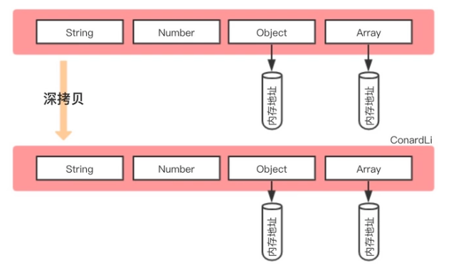

# Object

## 赋值
如果值的类型是基本类型，那么就是直接值。
如果值是引用类型，当我们把一个对象赋值给你一个新的对象时，赋的其实是该对象在栈中的地址，而不是堆中的数据。也就是两个对象指向的是同一个存储空间，无论哪个对象发生改变，其实都是改变的内存空间的内容，因此两个对象是联动的。


## 拷贝
拷贝是指由一个对象(data)生成另一个一模一样的对象(o1)。但是 o1 的修改不能影响 data的值

```javascript
const data = {
  tile: '第一个对象',
  dataIndex: 'first',
  componentProps: {
    path: 'user/',
    mode: 'add',
  }
}

const o1 = Object.assign({}, data)
const o2 = { ...data }
```


### 浅拷贝
浅拷贝是创建一个新对象，这个对象有着原始对象属性值的一份精确拷贝。**如果属性值是基本类型，拷贝的就是基本类型的值，如果属性是引用类型，拷贝的就是内存地址**，所以如果其中一个对象改变了这个地址中的内容，就会影响到另一个对象。

浅拷贝是：把 data 复制了过来，但是 data 的修改有可能会影响到 复制过来的对象 o1。
尤其是当 data 有个属性值为 对象的属性时。也就是说 我们不能深层次的复制。


实现浅拷贝的方式有
#### `Object.assign({}, data)`
```javascript
const o1 = Object.assign({}, data)
```

#### 展开运算符 `{ ...data }`
```javascript
const o2 = { ...data }
```

#### 也可以自己遍历复制属性
```javascript
function copy(o) {
  let res = {};
  for (const key in o) {
    res[key] = o[key];
  }
  return res;
}
```

#### concat 针对 Array
```javascript
// Array.prototype.concat()
const aa = [ 1, 2, { a: 3 } ].concat()

```

#### slice 针对 Array
```javascript
// Array.prototype.slice()  
const aa = [ 1, 2, { a: 3 } ].slice()
```


### 深拷贝
深拷贝是将一个对象从内存地址中玩完整的拷贝一份出来，从堆内从中开辟一个新的内存区域存放新对象，且修改新对象不会影响原对象。

深拷贝是：data 的修改不会影响到 o1，这是两个完全独立的对象。




#### 自己实现一个 `deepCopy`
```javascript
function deepCopy(obj) {
  let res = obj instanceof Array ? [] : {};
  for (const [k, v] of Object.entries(obj)) {
    res[k] = typeof v === "object" ? deepCopy(v) : v;
  }
  return res;
}
```


#### 利用 `JSON` api
```javascript
JSON.parse(JSON.stringify(arrayData))
```

缺点：作用于对象或者数组，不接受函数 

