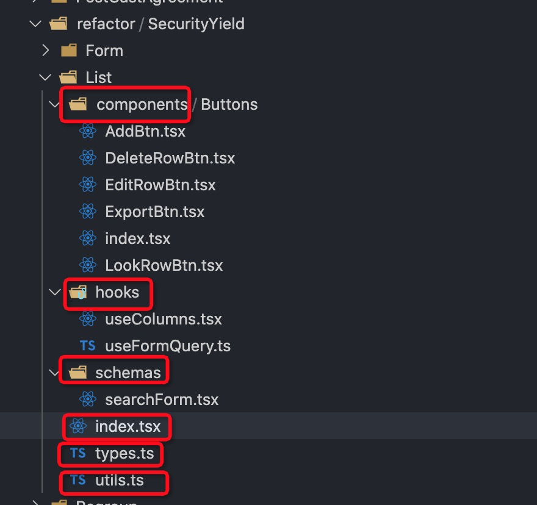

# 页面结构
这里的页面结构指的是：实现一个模块时，代码的目录和结构安排。

## 列表页面
大体的目录结构应当如下

目录说明：
| 文件名  | 说明  | 解释|
|-----|------| -----------|
| `components` |  页面级组件 | 非必须 |
| `hooks` |  页面级hook | 非必须 |
| `schemas` |  表单的搜索schema | 非必须 |
| `index` |  主页面 |  |
| `types` |  类型定义 | 非必须 |
| `utils` |  工具类 | 非必须 |

这样分层的目的是：
* 让主页面只有主干逻辑，没有别的分支逻辑或者细节逻辑
* 页面可服用性更好，这样分类之后，表单的列表和搜索项的schema可以在最大程度上得到复用。
* 清晰统一，使用这种方式之后，每个页面的组成都类似，这样我们能够以非常熟悉和迅速的方式找到想要的模块，指哪打哪。

这样分原因是：
* 在一个列表页面中，占据比较多位置是以下部分
    * searchFormItems 表单的搜索项
    这部分内容通过 schema 的方式分离出去，然后再搭配上`useFormTableQuery`，这样这部分代码就可以不在主页面中。
    * columns 表格的列
    这部分内容为什么是hook？这是因为，列表中有操作列，里面会有按钮的点击事件等操作，所以它应该是一个函数；为了性能优化，不做过多的渲染，我们需要使用 `useMemo` 进行包裹。这就是为什么是一个hook。
* 一些工具类和按钮及按钮的点击事件，为了复用和代码层级不要过深，分别放在了一个或者多个文件中，方便我们做进一步的抽象

额外的好处：
* 少了一些判断，比如新增按钮的mode就是 'add'
* 抽象了一些东西出来，比如 一些hook，一些组件。