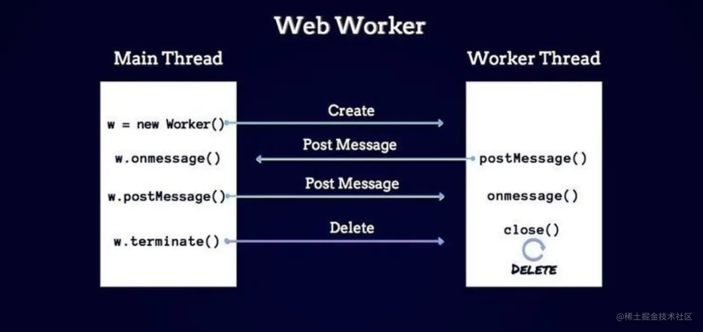

# Web Worker 基础

## Web Worker 是什么？

可以在独立于独立于主线程的后台线程中运行一个脚本，不会阻塞主线程。

主线程不会被阻塞，UI 的渲染不会阻塞，页面流畅的。

## 使用方式



### 普通项目

普通的项目，直接创建 Worker。

### webpack4 项目

需要使用 `worker-loader`。
worker-loader 配置

```typescript
//配置worker-loader
module.exports = {
    ...,
    module: {
        rules: [
            {
                test: /\.worker\.js$/,
                use: { loader: "worker-loader" },
            },
        ],
    },
}
```

```typescript
import Worker from './wasted.time.worker.js';
//在主线程中使用web worker
const worker = new Worker();
worker.onmessage = (e) => {
  console.log(e.data.value);
};
```

### webpackt5/vite

```typescript
// 方法一
const worker = new Worker(new URL('./worker.js', import.meta.url));

// 方法二
import Worker from './wasted.time.worker.js';
const worker = new Worker();

// 在 vite 中还可以这么使用 。通过 `url?worker`
import MyWorker from './worker?worker';
const worker = new MyWorker();
```

### 无依赖使用

utils.ts

```typescript
export const createWorkerUrl = (workerFunc: () => void) => {
  const blob = new Blob([`(${workerFunc.toString()})()`], {
    type: 'application/javascript',
  });
  const workerUrl = URL.createObjectURL(blob);
  return workerUrl;
};

// 下面是第二种方式
let code = workercode.toString();
code = code.substring(code.indexOf('{') + 1, code.lastIndexOf('}'));

const blob = new Blob([code], { type: 'application/javascript' });
const worker_script = URL.createObjectURL(blob);

export default worker_script;
```

worker.ts

```typescript
import { createWorkerUrl } from './utils';

const workerCode = () => {
  onmessage = function (e) {
    // onmessage获取传入的初始值
    let sum = e.data;
    for (let i = 0; i < 2000; i++) {
      for (let j = 0; j < 10000; j++) {
        // sum += Math.random();
        sum = `${sum}-${i}-${j}`;
        // sum += i;
      }
      console.log('zzzzz');
    }
    // 将计算的结果传递出去
    postMessage(sum);
  };
};

const workerScriptUrl = createWorkerUrl(workerCode);
export default workerScriptUrl;
```

main.ts

```typescript
import workerScriptUrl from './worker';

const worker = new Worker(workerScriptUrl);
// 监听message事件
worker.addEventListener('message', (e) => {
  // 关闭线程
  worker.terminate();
  // 获取计算结束的时间
  let end = performance.now();
  // 得到总的计算时间
  let durationTime = end - start;
  // console.log("计算结果:", e.data);
  console.log(`代码执行了 ${durationTime} 毫秒`);
});
```
