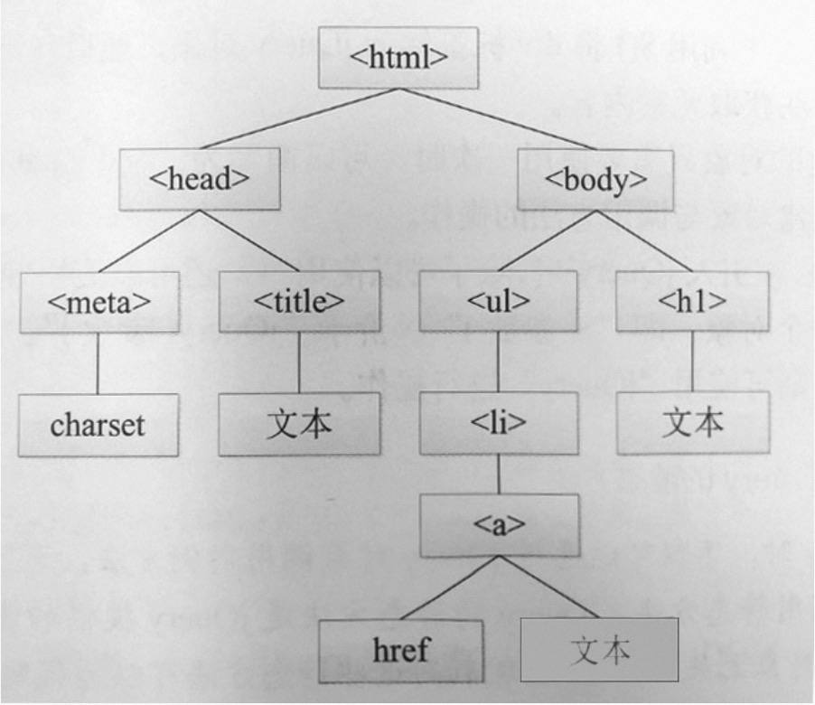

# DOM 基础

英文：`Document Object Model`
中文：文档对象模型

DOM 以树结构表达 HTML 文档（所以也叫 DOM 树），定义了访问和操作 HTML 文档的标准方法。

浏览器在加载页面的时候会生成 DOM 对象，以供我们使用 JS 控制页面元素。

示例：
一段 HTML 文档

```html
<html>
 <head>
  <meta charset="UTF-8">
  <title>测试</title>
 </head>
 <body>
  <h1>标题</h1>
  <ul>
   <1i>
    <a href="#">链接</a>
   </1i>
  </ul>
 </body>
</html>
```

DOM 树


## 基础知识

### 名称介绍

- **Document**：**一个页面就是一个文档**，DOM 中使用 `Document` 表示
- **Node**：网页中的**所有内容都是节点**（标签、属性、文本、注释等），DOM 中使用 `Node` 表示
- **Element**：页面中的所有**标签都是元素**，DOM 中使用 `Element` 表示

在 DOM 中以上内容都看成是对象。

他们的关系是：

- **Document** 是根节点
- **Node** 是所有节点的基类。
- **Node** 有很多子类，其中包含了 `Element` 和 `Text` 等

### 操作时机

需要保证浏览器已经渲染了内容才可以读取节点对象，下例将无法获取节点对象

```html
<script>
  const node = document.getElementById('gdz');
  console.log(node); // null
</script>
<h1 id="gdz">gengdezhou</h1>
```

解决方案为：

1. 任何时候把节点放在上面，把 `script` 放在下面

2. 使用定时器将脚本设置为异步执行

   ```html
   <script>
     setTimeout(() => {
       const node = document.getElementById('gdz');
       console.log(node);
     });
   </script>
   <h1 id="gdz">gengdezhou</h1>
   ```

3. 放在文档加载后的事件处理函数中

   ```html
   <script>
     window.onload = function () {
       let id = document.getElementById('id');
       console.log(id);
     };
   </script>
   <div id="h2d">ni</div>
   ```

4. 或将脚本设置在外部文件并使用 defer 属性加载，defer 即会等到 DOM 解析后迟延执行

   ```html
   <script defer="defer" src="3.js"></script>
   <div id="gdz"></div>
   ```

5. 声明为模块

   ```html
   <script type="module">
     const node = document.getElementById('gdz');
   </script>
   ```

### 节点对象

每个元素都是 DOM 树的节点。 **根节点是：Doucument 对象**

- 包括 12 种类型的节点对象
- 常用节点为：document、标签元素节点、文本节点、注释节点
- 节点都继承 Node，所以拥有相同的属性或者方法
- document 是 DOM 操作的起始节点

节点有很多种类型：

```javascript
// document节点 noteType 为9
console.log(document.nodeType);

// body 是标签节点 nodeType 为1
console.log(document.body.nodeType);
```

### 原型链

以 H1 为例子，打印它的原型链

```javascript
const h1 = document.getElementById('h1');
console.dir(h1);

function showProtoType(node) {
  if (!Object.getPrototypeOf(node)) {
    console.log('结束了');
    return;
  }
  const s = Object.getPrototypeOf(node);
  console.log(s);
  showProtoType(s);
}
showProtoType(h1);

// HTMLHeadingElement
// HTMLElement
// Element
// Node
// EventTarget
// Object
```

| 原型               | 说明                                              |
| ------------------ | ------------------------------------------------- |
| Object             | 根对象                                            |
| EventTarget        | 提供事件支持                                      |
| Node               | 提供 parentNode 等节点操作方法                    |
| Element            | 提供 getElementsByTagName、querySelector 等方法   |
| HTMLElement        | 所有元素的基础类，提供 className、nodeName 等方法 |
| HTMLHeadingElement | Head 标题元素类                                   |

### DOM 对象特征

可以像操作对象一样操作 DOM 元素，但是一些属性不能随便赋值(会影响元素)

```javascript
const h1 = document.getElementById('h1');
h1.name = 'sss';
h1.id = 'id';
h1.title = 'sssss'; // 鼠标放上去的时候就会提示文字
```

## 节点属性

### nodeType

通过 `node.nodeType` 来获取节点类型

| nodeType | 说明                                   |
| -------- | -------------------------------------- |
| 1        | **标签元素节点**                       |
| 2        | 属性节点                               |
| 3        | 文本节点。其中需要注意「空白文本节点」 |
| 8        | 注释节点                               |
| 9        | document 对象                          |

### nodeValue

通过 `node.nodeValue` 来获取节点的值

| nodeType | nodeValue |
| -------- | --------- |
| 1        | null      |
| 2        | 属性值    |
| 3        | 文本内容  |
| 8        | 注释内容  |

## 节点关系

由于 HTML 结构是嵌套的，所以节点对象也存在父子、兄弟、祖先、后代等节点关系。

### 基础知识

下面是通过节点关系获取相应元素的方法

| 节点属性        | 说明             |
| --------------- | ---------------- |
| childNodes      | 获取所有子节点   |
| parentNode      | 获取父节点       |
| firstChild      | 子节点中第一个   |
| lastChild       | 子节点中最后一个 |
| nextSibling     | 下一个兄弟节点   |
| previousSibling | 上一个兄弟节点   |

```javascript
const ul = document.querySelector('ul');
console.group('ul->child');
console.log(ul.childNodes);
console.log(ul.firstChild);
console.log(ul.lastChild);
console.groupEnd('ul->child');
```

### 元素关系

使用 childNodes 等获取的节点包括文本与注释，但这不是我们常用的，系统也提供了**只操作元素的关系方法**。

| 节点属性               | 说明                                             |
| ---------------------- | ------------------------------------------------ |
| parentElement          | 获取父元素                                       |
| children               | 获取所有子元素                                   |
| childElementCount      | 子标签元素的数量                                 |
| firstElementChild      | 第一个子标签                                     |
| lastElementChild       | 最后一个子标签                                   |
| previousElementSibling | 上一个兄弟标签                                   |
| nextElementSibling     | 下一个兄弟标签                                   |
| contains               | 返回布尔值，判断传入的节点是否为该节点的后代节点 |

```javascript
const ul = document.querySelector('ul');
console.group('ul-> element');
console.log(ul.children);
console.log(ul.firstElementChild);
console.log(ul.lastElementChild);
console.groupEnd('ul-> element');
```

判断 father 元素是否包含 e.target 元素

```bash
father.contains(e.target)
```

## 节点选取

### `getElement/getElements` 系列

#### `getElementById(id)`

```javascript
const h1 = document.getElementById('h1');
```

#### `getElementByName()`

根据 name 属性获取设置了 name 属性的**元素集合**

原则上只有**表单元素**有这个属性

#### `getElementsByTagName()`

根据标签名获取**元素集合**

```javascript
const divs = document.getElementsByTagName('div');
```

#### `getElementsByClassName()`

根据类型获取**元素集合**

```javascript
const divs = document.getElementsByClassName('class1 class2');
```

### 样式选择器 系列

#### `querySelector()`

获取匹配到的第一个元素

```html
<h1 id="h1">节点对象</h1>
<span class="span">节点对象 1</span>
<span class="span">节点对象 2</span>

<script>
  const h1 = document.getElementById('h1');
  const span = document.querySelector('.span'); // 节点对象 1
  console.log(span);
</script>
```

```html
<div id="app">
  <h1 id="h1">节点对象</h1>
  <span class="span" data="gengdezhou">节点对象 1</span>
  <span class="span">节点对象 2</span>
</div>

<script>
  const span = document.querySelector(`#app .span[data="gengdezhou"]`);
  console.log(span); // 节点对象 1
</script>
```

#### `querySelectorAll()`

选取符合样式选择器的 **NodeList 集合**。

用法和上面一样

### 获取特殊元素（body、html）系列

#### 获取 body 元素

```html
document.body // 返回 body 元素对象
```

#### 获取 html 元素

```html
document.documentElement
```

## 节点内容

### `innerHTML`

向标签中添加 HTML。里面外面都改。这里会触发「重绘」操作

```javascript
app.innerHTML = '<h1>h1</h1>';
```

```javascript
const ul = document.querySelector('ul');
ul.addEventListener('click', function () {
  alert(this.innerHTML);
  this.parentElement.innerHTML += '<hr/>新的内容';
});
```

因为是「重绘」，所以在上面的代码中，只会执行一遍，第二遍就不会生效了。

- 因为对 ul 内容进行了重绘，即删除原内容然后设置新内容
- 重绘后产生的 ul 对象没有事件

### `outerHTML`

**只改变外边，里面的内容不改**

```html
<body>
  <div id="app">
    <div>div1</div>
    <div>div2</div>
  </div>
  <script>
    let app = document.querySelector('#app');
    app.outerHTML = '<h1>新增h1</h1>';
    console.log(app); // 打印的内容依然是 div1,div2。显示的是 h1。只改变外观
  </script>
</body>
```

### `innerText | textContent`

获取和设置文本内容。

interText 不能识别 HTML 标签，会去除空格和换行。

```javascript
h3.innerText = '<h1>新增H1</h1>'; // 无论设置啥都是文本
```

### `outerText`

获取和设置文本，但是会影响所操作的标签。

### `insertAdjacentText`

将 「text 文本」插入到指定位置

| 选项        | 说明         |
| ----------- | ------------ |
| beforebegin | 元素本身前面 |
| afterend    | 元素本身后面 |
| afterbegin  | 元素内部前面 |
| beforeend   | 元素内部后面 |

```html
<body>
  <div id="app">
    <div>div1</div>
    <div>div2</div>
  </div>
  <script>
    const app = document.querySelector('#app');
    app.insertAdjacentText('beforebegin', '<h1>元素本身前面</h1>');
    app.insertAdjacentText('afterend', '<h1>元素本身后面</h1>');
    app.insertAdjacentText('afterbegin', '<h1>元素内部前面</h1>');
    app.insertAdjacentText('beforeend', '<h1>元素内部后面</h1>');
  </script>
</body>
```

## 创建节点

### `createElement(标签名)`

创建元素节点

```javascript
const article = document.querySelector('article');

const span = document.createElement('span');
span.innerText = '   createElement 方式增加一个 span';
article.appendChild(span); // 添加一个 span

const div3 = document.createElement('div');
div3.innerText = 'createElement -> 节点对象4';
article.appendChild(div3); // 添加一个 div
```

### `createTextNode(文本)`

创建文本节点

```javascript
const article = document.querySelector('article');
const text = document.createTextNode('  createTextNode 方式，节点对象 3');
article.appendChild(text); // 添加一个文本节点
```

### `cloneNode()`

克隆节点

```javascript
const article = document.querySelector('article');
const h1 = document.querySelector('h1');
const cloneH1 = h1.cloneNode(true); // true 表示深度克隆
article.appendChild(cloneH1); // 添加克隆的 h1
```

## 节点管理

### `append | prepend | before | after | replaceWith`

| 方法        | 说明                             |
| ----------- | -------------------------------- |
| append      | **节点尾部**添加新节点或者字符串 |
| prepend     | **节点开始**添加新节点或者字符串 |
| before      | **节点前面**添加新节点或者字符串 |
| after       | **节点后面**添加新节点或者字符串 |
| replaceWith | 将节点**替换成**新节点或者字符串 |

```javascript
const article = document.querySelector('article');

const appentDiv = document.createElement('div');
appentDiv.innerText = 'append 节点内 -》后面';
article.append(appentDiv);

const prependDiv = document.createElement('div');
prependDiv.innerText = '节点内 -》后面';
article.prepend(prependDiv);

article.before('节点外 -》前面', '还可以插入多个');
article.after('节点外 -》后面');

const h1 = document.querySelector('h1');
h1.after('<h1>字符串</h1>'); // 这里插入的也是字符串
// h1.after(<h1>字符串</h1>); // 这种方式也是不行的
```

说明：

- 添加的内容只能是 **字符串** 或者 **通过 `createElement` 创建的标签**
- 字符串会当成 「text 字符串」而不是「HTML 字符串」

### `insertAdjacentHTML`

将 「HTML 文本」插入到指定位置

| 选项        | 说明         |
| ----------- | ------------ |
| beforebegin | 元素本身前面 |
| afterend    | 元素本身后面 |
| afterbegin  | 元素内部前面 |
| beforeend   | 元素内部后面 |

```javascript
article.insertAdjacentHTML('beforebegin', '<div>beforebegin</div>');
article.insertAdjacentHTML('afterend', '<div>afterend</div>');

article.insertAdjacentHTML('afterbegin', 'div>afterbegin</div>');
article.insertAdjacentHTML('beforeend', 'div>afterend</div>');
```

### `insertAdjacentElement`

将指定元素插入到元素的指定位置

```javascript
const article = document.querySelector('article');

const div = document.createElement('div');
div.innerText = '新增div';

article.insertAdjacentElement('beforebegin', div);
```

### `remove()`

删除节点

```javascript
article.remove();
```

### DocumentFragment

当对节点进行添加、删除等操作时，都会引起页面回流，如果频繁操作，或者操作量太大都会影响页面性能。可以使用 `createDocumentFragment()` 来管理节点。

原理：此时的操作产生的节点等都存在内存中，而不是 DOM 树中，不会引起回流。

使用场景：在排序/移动等大量 DOM 操作时

```javascript
const ul = document.querySelector('ul');

function add(total, pieceCount) {
  // 创建虚拟节点。不会触发渲染
  const fragment = document.createDocumentFragment();

  for (let i = 0; i < pieceCount; i++) {
    const li = document.createElement('li');
    li.innerText = Math.floor(Math.random() * total);
    fragment.appendChild(li);
  }

  // 一次性添加 pieceCount 条数据
  ul.appendChild(fragment);
}
```

### 一些老方法

| 方法         | 说明                       |
| ------------ | -------------------------- |
| appendChild  | 添加节点                   |
| insertBefore | 插入元素到另一个元素的前面 |
| removeChild  | 删除节点                   |
| replaceChild | 节点替换                   |

## 元素特征

标准属性我们可以直接使用 DOM 属性的方式进行操作，但对于非标准的属性无法通过这种方式设置

### 基础操作

可以理解为元素的属性分两个地方保存，DOM 属性中记录标准属性，特征中记录标准和定制属性

- 使用特征操作时属性不区分大小写
- 特征值都为字符串类型

| 方法                        | 说明     |
| --------------------------- | -------- |
| setAttribute(属性名, value) | 设置属性 |
| getAttribute(属性名)        | 获取属性 |
| removeAttribute(属性名)     | 删除属性 |
| hasAttribute(属性名)        | 检测属性 |

```html
<body>
  <h1 id="h1">节点对象</h1>
  <span class="span" gdz="gdz">节点对象 1</span>
  <span class="span" sx="gdz">节点对象 2</span>
  <script>
    const h1 = document.getElementById('h1');
    const span1 = document.querySelector('.span');
    const span2 = document.querySelector('[sx]');

    // 标准属性可以直接用这种方式操作
    h1.style.background = 'red';

    // 自定义的属性不能用上面的方式
    span1.gdz = '耿德洲';

    console.log(span2);
    // 我们需要使用这种方式
    span2.setAttribute('sx', '耿德洲');
  </script>
</body>
```

### 自定义特征

随便我们可以随便命名特征，但是官方提供了标准的方式是 `data-自定义特征名` 有以下好处

- 会把我们自定义的值放在 `dataset` 中。
- 我们可以通过 `dataset` 设置或者获取值

```html
<span class="span" data-age="age">标准自定义特征</span>

<script>
  // 标准的自定义特征应该以 data- 开头
  console.log(div.dataset);
  div.dataset.age = '20';
</script>
```

## 表单控制

### 表单查找

- 使用 `document.forms` 获取表单集合
- 使用 form 的 name 属性获取指定的 form 元素。 `documnet.forms.form1`
- 使用 表单项的 name 属性获取表单项。`form.name`
- 如果已知一个表单项 item，那么可以使用 `item.form` 反向查找表单

```html
<form action="" name="form1">
  <input type="text" name="name" />
  <input type="number" name="age" />
</form>

<script>
  const form = document.forms.form1;
  console.log('fffff', form, form.name.form);
</script>
```

## 样式管理

我们可以使用更改元素的 class 属性或者通过 style 对象设置行样式来完成。

### 批量设置

- `app.className = 'css1'` 使用 JS 的 className 可以批量设置

  ```html
  <div id="app" class="d-flex container">样式</div>
  <script>
    let app = document.getElementById('app');
    app.className = 'css1';
  </script>
  ```

- `app.setAttribute('class', 'css2')`

### classList

| 方法                              | 说明                     |
| --------------------------------- | ------------------------ |
| `node.classList.add('css1')`      | 添加类                   |
| `node.classList.remove('css1')`   | 删除类                   |
| `node.classList.toggle('css1')`   | 有的话去掉，没有的话加上 |
| `node.classList.contains('css1')` | 是否包含该类             |

### 设置行样式

- `ele.style.color = 'green'`

  注意：**多个单词属性采用驼峰命名**

  ```html
  <script>
    const app = document.getElementById('app');
    app.style.backgroundColor = 'red';
    app.style.color = 'green';
  </script>
  ```

- <code>node.style.cssText = `background-color:red;color:yellow`</code>

  ```html
  <script>
    let app = document.getElementById('app');
    app.style.cssText = `background-color:red;color:yellow`;
  </script>
  ```

- `node.setAttribute('style', 值)`

```html
<script>
  let app = document.getElementById('app');
  app.setAttribute('style', `background-color:red;color:yellow`);
</script>
```

### 获取样式

- `ele.style | ele.style.backgroundColor | ele.style.margin`

  这种方式无法获取不是写在 style 标签里面的样式

- `ele.getComputedStyle(ele)`

  ```html
  <script>
    let app = document.getElementById('app');
    const fontSize = app.getComputedStyle(app).fontSize;
    console.log(fontSize, fontSize.slice(0, -2));
    console.log(parseInt(fontSize));
  </script>
  ```
