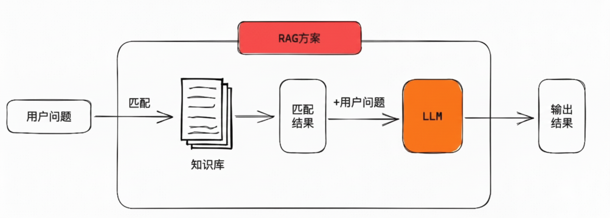
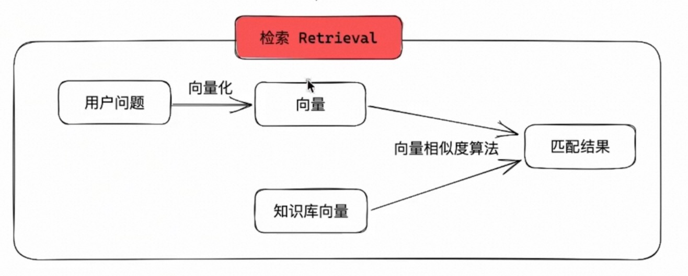

# Retrieval Augmented Generation

## 简介

Retrieval Augmented Generation（RAG）检索增强生成：是一种结合了信息检索和文本生成的技术。它通过从外部知识库中检索相关信息来增强生成模型的能力，从而提高生成内容的准确性和相关性。

## 为什么需要 RAG？

传统的大语言模型存在一些局限性：

- 功能性缺陷
  - 能听懂你啥意思，也知道怎么做，但是就做不到。 比如 你帮我点杯咖啡。 解决方案： MCP 和 Function Calling
- 知识性缺陷
  - 知识的"静态性"和"幻觉"问题。
    - 静态性： 当模型训练完成，知识就固定了。
    - 幻觉： 模型可能会生成看似合理但实际错误的信息。
  - 领域知识的"专业性"和"深度"不足。
  - 知识的"溯源"和"可信度"问题
    - 尤其是在法律，医疗、金融领域，当大模型回答了之后我们无法确定其来源和可信度。

为什么不直接把知识库作为提示词的一部分?
会使得提示词过长，上下文长了会代码下面的问题

- token 消耗很大
- "中间迷失"效应。模型会忽略文档中间的内容
- 信息过载与精度下降：模型会抓不住重点
- 可追溯性和可信度问题。你不知道答案的来源
- 技术实现的硬件约束: 上下文长度限制

RAG 解决方案



## 实现RAG核心

1. 索引 Indexing
   将知识库中的文档进行预处理和向量化，存储到向量数据库中，以便快速检索。
2. 检索 Retrieval
   将用户的问题与之前建立的索引进行匹配，得到相关度比较高的结果
3. 生成 Generation
   将匹配到的知识和用户的问题一起投递给LLM，从而得到准确的结果

### 索引

1. 分割 Split
2. 嵌入 Embedding
3. 存储 Storage

#### 分割 Split

作用是将一段长文本切分为多段段文本

##### 分割策略

| 分割方式     | 说明                    | 优点                                                     | 缺点                                                      | 适用场景                                                       | 成本/性能     | 复杂度     |
| ------------ | ----------------------- | -------------------------------------------------------- | --------------------------------------------------------- | -------------------------------------------------------------- | ------------- | ---------- |
| 字符分割     | 按固定字符数切割        | 1. 计算开销极小<br>2. 实现简单<br>3. 预测性强            | 1. 语义割裂严重<br>2. 无视文档结构<br>3. 质量较差         | 1. 日志文件处理<br>2. 非结构化数据<br>3. 性能敏感场景          | ⭐⭐⭐⭐⭐    | ⭐⭐       |
| 递归分割     | 按分隔符优先级递归切割  | 1. 保持语义完整性<br>2. 通用性强<br>3. 质量较好          | 1. 仍需预设规则<br>2. 对特殊结构不敏感<br>3. 可能过度分割 | 1. 通用文档处理<br>2. 混合内容类型<br>3. 大多数 RAG 应用       | ⭐⭐⭐⭐      | ⭐⭐⭐     |
| Token 分割   | 按 LLM token 数切割     | 1. 精确控制上下文<br>2. 适配 LLM 限制<br>3. 计费相关性强 | 1. 依赖 tokenizer<br>2. 可能割裂语义<br>3. 计算开销较大   | 1. 精确预算控制<br>2. OpenAI 等 API 使用<br>3. 生产级 RAG 系统 | ⭐⭐⭐        | ⭐⭐⭐⭐   |
| 语义分割     | 基于嵌入向量相似度      | 1. 真正的语义边界<br>2. 自适应分割<br>3. 质量很高        | 1. 计算成本高<br>2. 需要嵌入模型<br>3. 参数调优复杂       | 1. 高质量知识库<br>2. 学术文献处理<br>3. 对质量要求极高的场景  | ⭐⭐          | ⭐⭐⭐⭐⭐ |
| LLM 智能分割 | 使用 LLM 理解内容后分割 | 1. 质量最高<br>2. 理解文档结构<br>3. 完全自适应          | 1. 成本非常高<br>2. 速度很慢<br>3. 输出需要解析           | 1. 关键业务文档<br>2. 复杂结构文档<br>3. 预算充足的场景        | ⭐            | ⭐⭐⭐⭐⭐ |
| 混合分割     | 组合多种策略            | 1. 平衡质量与成本<br>2. 灵活适应需求<br>3. 鲁棒性强      | 1. 系统复杂<br>2. 需要调参<br>3. 维护成本高               | 1. 企业级应用<br>2. 多样化文档类型<br>3. 生产环境              | ⭐⭐~⭐⭐⭐⭐ | ⭐⭐⭐⭐⭐ |

生产中可以用 langchain 这个库

#### 嵌入

将一段文本专程一个多维向量的数学表达式，为后续的检索提供便利

要点：相关性匹配。数字化。

转成向量的过程叫做嵌入

举例

```bash
苹果 = ［0.95,0.90，-0.85，-0.60，-0.75，-0.90，-0.70，-0.50，……］

apple_semantic_vector = {
  "维度1 - 食物属性": 0.95,      # 正数：是可食用水果
  "维度2 - 科技关联度": 0.90,    # 正数：关联苹果公司
  "维度3 - 危险程度": -0.85,     # ⭐负数：非常安全，几乎无害
  "维度4 - 价格昂贵度": -0.60,   # ⭐负数：相对亲民，不昂贵
  "维度5 - 稀有程度": -0.75,     # ⭐负数：非常常见，不稀有
  "维度6 - 苦味程度": -0.90,     # ⭐负数：完全不苦，通常是甜的
  "维度7 - 人工加工度": -0.70,   # ⭐负数：天然食品，加工程度低
  "维度8 - 季节性限制": -0.50    # ⭐负数：全年可得，季节限制小
  ...
}

```

维度有 768，1024，1536，甚至更高，具体取决于所使用的嵌入模型

针对一段文本核心逻辑为

> 文本 -》 token化 -> 嵌入 -》池化 -》结果

嵌入模型 可以使用 nomic-embed-text （使用使用ollama 本地部署）

#### 存储 Storage

将嵌入后的向量存储到向量数据库中，

- 小型项目（<10万向量）：Chroma、pgvector、SQLite
- 中型应用（10万-1000万）：Qdrant、Weaviate、Elasticsearch
- 大型系统（>1000万）：Milvus、专用云服务

```typescript
/**
* 创建知识库索引
*/
export async function indexing() {
  const pdf = await getDoc();

  // 1. 分割
  const chunks = await split(pdf);

  // 2. 嵌入
  const vectors = await Promise.all chunks.map(embeddings));
  const result = chunks.map((text, i)=>({ text, embeddings: vectors[i] }))

  // 3. 存储
  await saveToVectorDB(result);
}
```

### 检索 Retrieval

核心目标：将用户问题与知识库中的向量进行匹配，找到最相关的文档片段



可以使用余弦相似度计算相似度

$$
\cos(\theta) = \frac{A \cdot B}{\|A\| * \|B\|}
$$

可见，余弦相似度仅与方向有关，和向量长度无关。

它的取值范围是 **-1 ~ 1**：

- **-1**：两个向量方向完全相反，属于反义
- **0**：两个向量垂直，含义完全无关
- **1**：两个向量方向完全相同，属于同义

> 为什么余弦相似度只看方向，不看长度？
>
> **长度无关性**：因为长度仅表示意思的程度，不会改变含义本身

```typescript
export async function retrieval(prompt) {
  const promptEmbeddings = await embeddings(prompt);

  const content = await readFile(INDEX_FILE);
  const indexing = JSON.parse(content);

  const matches = indexing
    .map((i) => ({
      text: i.text,
      similar: cosineSimilarity(promptEmbeddings, i.embedding),
    }))
    .sort((a, b) => b.similar - a.similar)
    .slice(0, 10);

  return matches.map((i) => i.text).join('\n\n');
}
```

### 生成 Generation

把检索到内容和原始问题一起输入给大语言模型，让模型基于这些信息生成最终的答案。

```typescript
async function bootstrap() {
  await indexing();

  const question = '哪款牛奶手机更适合拍照？';
  const doc = await retrieval(question);

  const prompt = `参考以下文档内容，回答用户的问题。

文档内容：
-------

${doc}

-------

用户问题：
${question}`;

  const answer = await chat(prompt);
  console.log(answer);
}

bootstrap();
```
