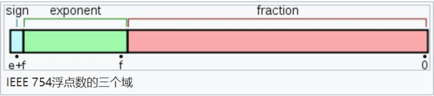

# 问题库


[toc]


* 做的项目的难点，怎么解决的？
* 浏览器的渲染机制？什么情况下会阻塞渲染？有什么性能优化上的措施？
* 浏览器安全方面了解吗？大概的流程？如何预防？XSS、CSRF
* redux中action如何触发reducer异步执行的？底层原理问题
* 场景题：在TypeScript中，需要继承现有类别，但是只需要其中的几个变量，如何实现？
* 实现一个简单的发布订阅者模式
* 场景题：需要并发发送10个请求，要求限制3个请求并发，等请求响应之后继续发生下一个请求。
* useEffect和useState结合的hooks题，在useEffect中(依赖项为[])执行副作用interval中实现状态变量加一操作，问输出什么？修改代码实现累加操作？
* 事件循环题
* 对象类型数组指定key去重


## 类型体操

```typescript
// 完成 Fn
type Fn = <T extends object, K extends keyof T>(obj: T, key: K) => T[K];
const getObjProp: Fn = (obj, key) => obj[key];

getObjProp({ name: 'xx' }, 'age'); // 类型报错

getObjProp({ name: 'xx' }, 'name'); // 类型不报错
```

## 垂直居中布局

## 浮动引起的问题？什么时候要清除浮动？如何清除浮动？

## SSR 整个阶段流程 & 大概原理。

## 微前端

## css

讲讲盒子模型，由外到内？margin/border/padding/content

box-sizing 与 content-sizing 的区别

一个空 div，padding-top: 100%; background: red; 会显示什么？

## Hooks 为什么不能写在条件语句中

## 介绍一下项目的难点以及怎么解决的

## 在以往的工作经历中有哪些最有成就感的项目

## 自己未来的发展规划是什么

可以从两个方面来讲，

- 一个走技术路线
- 一个走管理路线。

技术路线：

- **已经掌握的技术持续精进**，并通过技术手段去回馈团队和业务（如前端架构、异常监控、性能优化等）
- **持续扩宽技术广度**。多应用端、前后端
- 在某一个技术方向上做到突出，能够沉淀出相应方法论，并建设出系统性的平台，在部门及公司内部普及应用

管理路线：

- 定目标 —— 包含业务支撑、技术成长和团队培养三部分
- 看执行 —— 主要是对现有流程的问题进行梳理，让过程更加规范化、流程化，同时需要发掘高潜，给其空间快速成长
- 拿结果 —— 需要有可量化的具体数据来作为结果的衡量依据

## 如何保证项目质量

项目管理

- 任务分配
- 进度追踪
- 风险管理

代码质量

- 项目 lint 规则。强约束。（甚至连函数名叫什么都可以规定到）
- 给模板代码（通过命令生成）
- 自测
- CR

交付质量：

- 开发自测，给出自测用例。
- 交叉测试。（你的功能我来看，我的功能你来看）
- 共同 CR

## js 的垃圾回收机制是怎么实现

引用计数法和标记清除法。

**引用计数法**即在变量引用的时候将变量的引用计数+1，当变量的引用失效时（如离开作用域或者手动删除）将计数-1，直到计数为 0 时将该变量销毁。但是这种方法在出现循环引用时会有问题，所以后来 js 更新了自己的垃圾回收机制，采用了标记清除法。

**标记清除法**是在变量进入到某个作用域时对变量计数+1，从某个作用域离开时则对变量计数-1，最终计数为 0 时则销毁变量。

### 标记清除法

标记阶段：从 一组根 出发，遍历整个对象，对这些对象打上标记，代表他们是 可达的。

根可能包括全局对象，当前运行时的所有执行上下文（执行栈）中的变量和对象

清除阶段：如果没有被标记，那么就会被清除。

标记的时机：

引擎通常在检测到内存压力时开始标记过程，这可能是由于内存消耗达到一定水平，或者监测到程序在内存分配上的行为改变。

清除的时机：利用程序执行中的空闲时间来执行垃圾回收

此外，为了避免长时间的垃圾回收过程导致程序卡顿，引擎可能会执行增量回收，分步骤地进行标记、清除操作

## 说一说 Promise 的实现

## 说一下你的项目有哪些复杂的点，以及怎么解决的

## `==` 和 `===`

### `==`

JS 中 **`==` 是等值符**，当两边的类型相同时直接比较，当两边的类型不同时先转换成类型相同的值再比较，比较规则如下

1. **如果两边是 `boolean`、`string`、`number` 三者中任意两个进行比较时，优先转换成 `number` 进行比较**
2. **如果两边出现了 `null` 或者 `undefined`，`null` 和 `undefined` 自身相等，并且彼此相等**
3. `NaN` 和所有值都不相等，和 `NaN` 也不相等

补充说明其他类型转 number 的规则：

- boolean 类型转数字
  - true 转换为 1，false 转换为 0
- 字符串类型转数字
  - 空字符串或者全是空格的字符串转换为 0
  - 纯数字的字符串转换成数字
  - 字符串中带有非数字内容时，转换成 NaN
- null 转数字
  - null 转换成 0
- undefined 转数字
  - undefined 转换为 NaN

JS 中布尔值为 `false` 的 6 种情况

**在 JS 中一下 6 种情况转换成布尔值是为 false，其它均为 true**

- ""（空字符串）
- 0（数字 0）
- null
- undefined
- NaN
- flase

具体的可以看下这个规则：[非严格相等==](https://developer.mozilla.org/zh-CN/docs/Web/JavaScript/Equality_comparisons_and_sameness#%E9%9D%9E%E4%B8%A5%E6%A0%BC%E7%9B%B8%E7%AD%89)

### `===`

JS 中 **`===` 是等同符**，类型不同，直接返回 false，类型相同再比较值

### TS 中 `==` 和 `===`

在 TS 中 `==` 或者 `===` 使用方法和 JS 中不同点有

1. TS 中如果两边是 boolean、stirng、number 三者中的任意两个那么编译不通过。类似 `1 == false`、或者 `1 == '1'` 等，将直接报错

## 如何实现一个无限下拉的 List

## 高阶组件的利弊，高阶组件如何拿到 ref

## 高阶组件的实现方式？

1. 属性代理（Props Proxy）
2. 反向继承（Inheritance Inversion）

## 前端防止表单重复提交的方法

1. 提交完之后把提交的 Button 禁用掉。
2. Button 处于 loading 状态
3. 使用防抖（debounce）和节流（throttle）函数

## 锚点？

## 0.1 + 0.2 为什么不等于 0.3？

因为在计算机中，所有的数据都是二进制存储的，数字同样也是二进制保存的。0.1 转化为二进制为：0.0001100110011001100...（1100 循环）；0.2 转化为二进制为：0.00110011001100...（1100 循环）；

不可能唇齿一个无限循环的数字，那么在 JS 中是怎么存储的呢？使用 64 位固定长度表示，也就是标准的 double 双精度浮点数。

 在计算机中，浮点表示法，分为三大部分，如上图所示：

双精度浮点数一共占据 64 位：

- 第一部分（蓝色）用来存储符号位（sign），用来区分正负数，0 表示正数。1 位。
- 第二部分（绿色）用来存储指数（exponent）。11 位
- 第三部分（红色）用来存储小数（fraction）。52 位。

小数是一直 x2，直到余数为 0，然后从上往下，就是它的二进制整数是一直 /2，直到余数为 0，然后从下往上，就是它的二进制

所以 0.1 + 0.2 也是无限循环的数字，转换十进制刚好结果是：0.30000000000000004。

大多数语言就是有这个问题的，包括 Java。

解决方法：

1. 考虑到每次浮点数运算的偏差非常小（其实不然），可以对结果进行指定精度的四舍五入，比如可以 `parseFloat(result.toFixed(12))`;
2. 将浮点数转为整数运算，再对结果做除法。比如 0.1 + 0.2，可以转化为 `(1*2)/3`。
3. 把浮点数转化为字符串，模拟实际运算的过程。使用一些库比如： bigNumber.js 前面两种方案在一些情况下可能会有问题，推荐第 3 种

参考资料 [0.1 + 0.2 !== 0.3?](https://juejin.cn/post/6844903700356399112)

## 快速排序

## 手写深拷贝

## 手写 event bus

## 手写 bind

## 手写 Promise

## 手写快速排序

## JS 中 `::`

函数绑定运算符，它提供了一种方便的语法来创建一个新函数，这个新函数将有一个固定的 this 值，指向：:左侧的对象。

```js
const obj = {
  method() {
    console.log(this);
  },
};

obj::obj.method;
```

等同于 obj.method.bind(obj);

## 单点登录、免登录

单点登录就是类似 百度贴吧，和百度网盘，在一个点登录了，就不需要在别的点登录

实现单点登录有 3 种方式

1. 父域 Cookie
2. 认证中心
3. LocalStorage 跨域

实现单点登录的关键在于，如何让 Session Id（或 Token）在多个域中共享。

#### 父域 Cookie

Cookie 有一个特点，就是 父域中的 Cookie 可以被子域共享。此种实现方式比较简单，但不支持跨主域名。

#### 认证中心

认证中心就是一个专门负责处理登录请求的独立的 Web 服务

[登录和单点登录](https://juejin.cn/post/6933115003327217671)

## 权限管理如何做（菜单管理）

## ES6 中 对 Object 增强了哪些功能

## ES6 中 对 Function 增强了哪些功能

## CSS 三角形

## 大数相加（类似 bigNumber)

思路有：转成字符串，补 0

## 一些新特性 Promise.any

## 随想 使用正则的方式方式打平数组

## 继承

## React 跨域的方式（Nginx 的方式，devService 的具体动作）代理的过程

## 混合开发

## React 中类似 Vue keep-aliva 的功能如何实现

## less scss css 如何选择，以及差异。

1. 编译环境不同，less 是客户端编译，scss 服务端编译
2. 变量符不同
3. 语法不同，scss 可以 if/else，也可以循环

## webpack 打包的构建流程

## webpack 的热更新

## webpack 的打包体积和打包速度优化

## 手写一个 webpack loader 和 plugin

## webpack 插件系统

## webpack**require**

## fetch axios ajax 的区别，优缺点为什么用，创建步骤，使用步骤

## 状态码 405，401，403，414，301，302，502，501，500，

## 懒加载 & 预加载

## 图片懒加载和预加载

## React Fiber

## React diff 算法

## 脚手架，打包，发布，部署流程

## 不同的环境不同的代码，ENV 的注入过程

## CDN 的优化，体现在哪几个方面。CDN 的劣势

- 对用户来说比较快
- 对开发来说，一些包不用打包了，提交小

## 实现继承的方式

## useMemo 如何实现第 2 个函数的监听

浅比较

## useMemo 和 memo 的使用和区别

memo 是 React 提供的高阶组件，如果第二个参数不传递，则默认只会进行 props 的浅比较。相当于 shouldComponentUpdate 的作用

useMemo 我们只是希望 component 的部分不要进行 re-render，而不是整个 component 不要 re-render，也就是要实现 局部 Pure 功能。

## Generator 执行细节

```javascript
function* helloWorldGenerator() {
  yield 'hello';
  yield 'world';
  return 'ending';
}

const hw = helloWorldGenerator();
hw.next();
// { value: 'hello', done: false }

hw.next();
// { value: 'world', done: false }

hw.next();
// { value: 'ending', done: true }

hw.next();
// { value: undefined, done: true }
```

next 方法会返回一个对象 {value, done}

## for in 和 for of 的区别

for...in 遍历的时候，是取的 索引，一般用来遍历对象

for...of

1. 遍历的时候，取的是值，用来遍历数组，不能用来遍历对象。
2. for...of 循环可以自动遍历 Generator 函数运行时生成的 Iterator 对象，且此时不再需要调用 next 方法。

## CSS 省略

需要注意的点：

1. **必须是块元素**

```css
.text-ellipsis {
  overflow: hidden;
  white-space: nowrap;
  text-overflow: ellipsis;
}
```

## 根据宽度自动适配文本的长度，针对 Ellipsis

## 什么是副作用

## React 是什么，为什么使用 React，React 的优点

## 定位到页面某一位置的方法

锚点

## 记录 previous state

## Modal 弹窗挂在到 body 下面

1. 通过 ref 拿到 DOM 结构
2. 在 didMount 或者 初始化完成之后，把 DOM 节点放在 body 下面

## 使用 Math.max() 求数组最大值

## ES5 继承

## 数组结构转树结构

## try...catch 能捕获 setTimeout 错误吗？

## React diff 算法

## Fiber 架构

## 性能优化

衡量标准工程方面页面方面组件方面浏览器方面

## HTTP

## 网络安全

## 项目的痛点项目的核心价值

## 项目以后的发展方向

## 项目管理，工程管理

## this.stateState 同步异步

其实就是调用 enqueueSetState 方法

### 合成事件中的 setState

什么是合成事件，react 为了解决跨平台，兼容性问题，自己封装了一套事件机制，代理了原生的事件，像在 jsx 中 onClick，onChange 这些都是合成事件

在合成事件中 isRendering、isBatchingUpdates、isUnBatchingUpdates 3 个值为 false，false，true，导致在 requestWork 中被 return，没有走到 performWorkOnRoot 或者 performSyncWork，return 后的代码会回到 click event callback 执行其他代码

```javascript
function requestWork(root, expirationTime) {
  addRootToSchedule(root, expirationTime);

  if (isRendering) {
    // Prevent reentrancy. Remaining work will be scheduled at the end of
    // the currently rendering batch.
    return;
  }

  if (isBatchingUpdates) {
    // Flush work at the end of the batch.
    if (isUnbatchingUpdates) {
      // ...unless we're inside unbatchedUpdates, in which case we should
      // flush it now.
      nextFlushedRoot = root;
      nextFlushedExpirationTime = Sync;
      performWorkOnRoot(root, Sync, false);
    }
    return;
  }

  // TODO: Get rid of Sync and use current time?
  if (expirationTime === Sync) {
    performSyncWork();
  } else {
    scheduleCallbackWithExpiration(expirationTime);
  }
}
```

在 interactiveUpdates$1 函数中会把 isBatchingUpdates 设置成 true。

### 生命周期函数中的 setState

其实和合成事件一样，当 `componentDidmount` 执行的时候，react 内部并没有更新，执行完 `componentDidmount` 后才去 `commitUpdateQueue` 更新。这就导致你在 componentDidmount 中 setState 完去 console.log 拿的结果还是更新前的值。

### 原生事件中的 setState

addEventListener、document.querySelector().onclick 这种都是原生事件的形式

enqueueSetState -> requestWork 在原生事件中 requestWork 里由于 expirationTime === Sync 的原因，直接走了 performSyncWork 去更新，并不像合成事件或钩子函数中被 return，所以当你在原生事件中 setState 后，能同步拿到更新后的 state 值。

### setTimeout 中的 setState

在 setTimeout 中去 setState 并不算是一个单独的场景，它是随着你外层去决定的，因为你可以在合成事件中 setTimeout ，可以在钩子函数中 setTimeout ，也可以在原生事件 setTimeout，但是不管是哪个场景下，基于 event loop 的模型下， **setTimeout 中里去 setState 总能拿到最新的 state 值。** 举个栗子，比如之前的合成事件，由于你是 setTimeout(\_ => { this.setState()}, 0) 是在 try 代码块中，当你 try 代码块执行到 setTimeout 的时候，把它丢到列队里，并没有去执行，而是先执行的 finally 代码块，等 finally 执行完了， isBatchingUpdates 又变为了 false ，导致最后去执行队列里的 setState 时候， requestWork 走的是和原生事件一样的 expirationTime === Sync if 分支，所以表现就会和原生事件一样，可以同步拿到最新的 state 值。

### setState 的批量更新

在 setState 中 React 内部会创建一个 `updateQueue`，通过 `firstUpdate` `lastUpdate` `lastUpdate.next` 去维护一个更新的队列，在最终的 performWork 中，相同的 Key 会被覆盖，只会对最后一次的 setState 进行更新

```javascript
function createUpdateQueue(baseState) {
  var queue = {
    expirationTime: NoWork,
    baseState: baseState,
    firstUpdate: null,
    lastUpdate: null,
    firstCapturedUpdate: null,
    lastCapturedUpdate: null,
    firstEffect: null,
    lastEffect: null,
    firstCapturedEffect: null,
    lastCapturedEffect: null,
  };
  return queue;
}

function appendUpdateToQueue(queue, update, expirationTime) {
  // Append the update to the end of the list.
  if (queue.lastUpdate === null) {
    // Queue is empty
    queue.firstUpdate = queue.lastUpdate = update;
  } else {
    queue.lastUpdate.next = update;
    queue.lastUpdate = update;
  }
  if (queue.expirationTime === NoWork || queue.expirationTime > expirationTime) {
    // The incoming update has the earliest expiration of any update in the
    // queue. Update the queue's expiration time.
    queue.expirationTime = expirationTime;
  }
}
```

### 总结

1. setState 只有在合成事件和钩子函数中是异步的，在原生事件和 setTiemout、Promise 中都是同步的。
2. setState 的异步不是因为因为内部由异步代码实现，其实本身执行的过程和代码都是同步的，只是合成事件和钩子函数的调用顺序在更新之前，导致在合成事件和钩子函数中没法立马拿到更新后的值，形式了所谓的“异步”，当然可以通过第二个参数 setState(partialState, callback) 中的 callback 拿到更新后的结果。
3. setState 的批量更新也是建立在异步之上的，在原生事件和 setTimeout 中不会批量更新，在“异步”中如果对同一个值进行多次 setState ， setState 的批量更新策略会对其进行覆盖，取最后一次的执行，如果是同时 setState 多个不同的值，在更新时会对其进行合并批量更新。

## React Hooks 的用法和解决的问题

## 以及 XSS/CSRF 防范措施 底层原理

比如 xss 一般发生在哪些地方？分别对应什么方法去防范？具体有哪些字符需要转义，why？项目目前是怎么实现的？前端需要注意什么？

## 质量监控保障

Script error. 这不是一个 JS 错误，有时也被称为跨域错误。 **当网站请求并执行一个托管在第三方域名下的脚本时，就可能遇到该错误**

出于安全考虑，浏览器会刻意隐藏其他域的 JS 文件抛出的具体错误信息，这样做可以有效避免敏感信息无意中被不受控制的第三方脚本捕获

### 解法 1: 开启 CORS （跨站资源共享）

1. 添加 crossorigin="anonymous" `<script src="http://another-domain.com/app.js" crossorigin="anonymous"></script>` 意思就是告诉浏览器以匿名的方式获取目标脚本。

2. Access-Control-Allow-Origin: \*

### 解法 2: try catch

### 如果在 arms 中遇到这个错误

可以使用 配置 ignore

```javascript
__bl.setConfig({
  ignore: {
    ignoreErrors: /^Script error\.?$/,
  },
});
```

### webpack 中遇到这个错误

可以使用

```javascript
config.output.crossOriginLoading('anonymous');
```

## 如何衡量方案好不好

数据支撑、业务结果、落地覆盖到其他团队 都可以

现在遇到的业务问题

1. 用户在发起审批时体检不佳通过 稳定性（页面耗时，异常率，）有用性

2. 审批流程太长且复杂

3. 用户希望关注点聚焦 & 页面逻辑复用

PV 页面的访问量 PV（Page View）访问量，即页面浏览量或点击量

## Serverless


## 低代码

哪几家

## immutable（数据不可变）

一旦创建就不能再被改变。对一个数据操作不会影响之前的数据。比如 Array 中 push、pop 等方法都会改变原数组，这种都是非 immutable。去除引用数据类型副作用的数据的概念我们称作 immutable，意为不可变的数据

- import { Map } from 'immutable';
- immer

## 开发一个组件库需要注意什么

版本控制 demo 主题色
