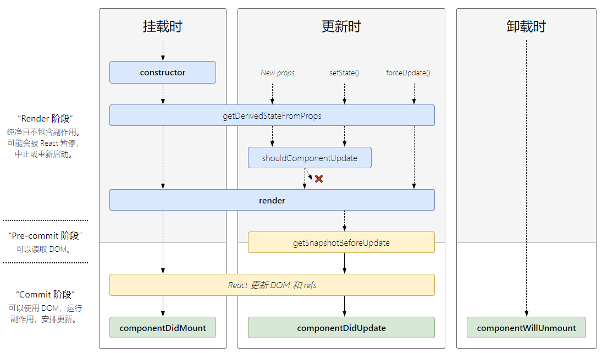

# React基础知识

## React的生命周期

这里需要说明的是。react的生命周期在不同的版本可能不同，总的来说React组件的生命周期分为三个部分:

装载(Mounting)、更新(Updating)、卸载(Unmounting)。

另外还有一个 [**`static getDerivedStateFromError(error)`**](https://zh-hans.reactjs.org/docs/react-component.html#static-getderivedstatefromerror) 用于捕捉错误

## 装载阶段

组件被实例化并被挂载到DOM树这一过程称为装载，装载期间调用的生命周期函数依次是：

- [**`constructor()`**](https://zh-hans.reactjs.org/docs/react-component.html#constructor)
- [`static getDerivedStateFromProps()`](https://zh-hans.reactjs.org/docs/react-component.html#static-getderivedstatefromprops)
- [**`render()`**](https://zh-hans.reactjs.org/docs/react-component.html#render)
- [**`componentDidMount()`**](https://zh-hans.reactjs.org/docs/react-component.html#componentdidmount)

