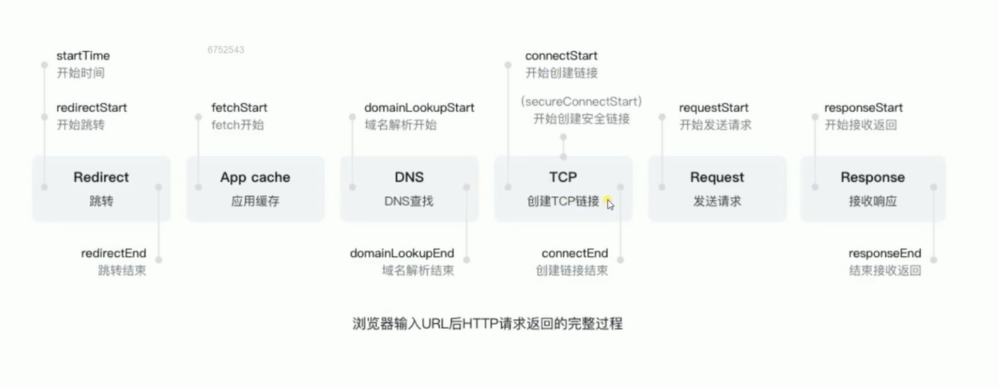

# Http协议基础

## 前置知识

### 经典的五层模型

| 名称       | 关键词                                                       |
| ---------- | ------------------------------------------------------------ |
| 应用层     | HTTP/FTP                                                     |
| 传输层     | TCP/UDP 数据的分片和组装                                |
| 网络层     | IP，DNS                                                      |
| 数据链路层 | 在通信的实体间建立数据链路连接 物理设备已经通过物理层创建了连接 通过软件创建电路的连接用来传输数据(基础的就是 0 1) |
| 物理层     | 定义物理设备如何传输数据，网卡，网线，端口，光缆 硬件设备相关的东西 |

> 说明：一次TCP连接可以发送一个或者多个http请求

### TCP建立连接的三次握手

说明：

* SYN是同步（标志位)，其中 1为是，0为否，
* Seq是序号，数据包本身的序列号
* ACK是期望对方继续发送的那个数据包的序列号。第三次Seq = X+1
* ACK是对收到的数据包的确认，值是等待接收的数据包的序列号。

为什么需要三次握手？

* 防止服务端开启一些无用的连接。
* 如果只有两次握手那么可能因为网络原因客户端没收到，然后客户端就会发送创建新的连接的请求，而这个时候服务端就会再新建一个连接，这就导致了服务端开启了无用的连接
* 维持序列号

### URI和URL

* uri：统一资源标识符，身份证号码
* url: 统一资源定位符，身份证号+住址

## http使用场景
* REST = http协议 + json
* API = http + json/xml
* webservice = http协议 + XML

## 什么是http协议

http协议就是客户端，服务端按照一定的规则进行交流，客服端按照一定的规则发送请求，服务端按照一定的规则发送响应数据

## http报文格式

在Chrome中

General就是起始行

## 请求分为两种

简单请求和非简单请求

什么是简单请求?

> （1) 请求方法是以下三种方法之一：
>
> - HEAD
> - GET
> - POST
>
> （2）HTTP的头信息不超出以下几种字段：
>
> - Accept
> - Accept-Language
> - Content-Language
> - Last-Event-ID
> - Content-Type：只限于三个值`application/x-www-form-urlencoded`、`multipart/form-data`、`text/plain`

同时满足这两个要求的就是简单请求。

对于非简单请求，浏览器就会先发送一次预请求，方法是Options

## 跨域问题

跨域是浏览器的拦截机制，要说明的是

* 请求已经发送了
* 服务器也返回了数据
* 浏览器没看到Access-Control-Allow-Origin，就把请求返回的内容忽略掉，并且报错

解决方案：

| 方法 | 说明                                                         |
| ---- | ------------------------------------------------------------ |
| CORS | 在服务端设置`'Access-Control-Allow-Origin': '*'` CORS这种方式只要在服务器端设置这个即可 这里还可以设置的有 `'Access-Control-Allow-Headers': 'X-Test-COrs'`， `'Access-Control-Allow-Methods': 'POST,PUT,DELETE'`， `'Access-Control-Max-Age': 1000` |
|      |                                                              |

## Cache-Control

1. 可缓存性
   - public  http经过的任何地方就可以加上缓存
   - private  只能发起请求的浏览器才可以缓存
   -  no-cache  不可以进行缓存
2. 到期
   * max-age = <seconds>  设置有效时长
   * s-maxage = <seconds>  为代理服务器设置
   * max- stale=<seconds>   表示超过了有效期也可以使用缓存的时间。客户端设置
3. 重新验证
   * must-revalidate 过期之后，必须重新发送请求验证，而不能直接使用缓存
   *  proxy- revalidate 指定缓存服务器过期了，必须到原服务器再次发送请求
4. no-store 不允许使用缓存
5. no-transform 不允许中间服务器对发起的请求做改动
6. 前端使用缓存，但是服务端有变化了又能去请求服务器怎么操作
   * 使用webpack打包时，在js文件名上加上hash码

## 资源验证

| 请求头        | 解释                                     | 说明                      |
| ------------- | ---------------------------------------- | ------------------------- |
| Last-Modified | 上次修改时间                             | 配合If-Modified-Since使用 |
| Etag          | 数据签名 一般对资源内容进行hash计算 | 配合If-Match使用          |

## 常用请求头	

| 协议头                                                  | 说明                                                         | 示例                                                         |
| ------------------------------------------------------- | ------------------------------------------------------------ | ------------------------------------------------------------ |
| Accept                                                  | 可接受的响应内容类型                                         | Accept： text/plain                                          |
| Accept-Charset                                          | 可接受的字符集                                               | Accept-Charset: utf-8                                        |
| Accept-Encoding                                         | 响应内容的编码                                               | Accept-Encoding：gzip,deflate |
| Accept-Language | 可接受的语言列表                                             | Accept-Language                                              |
| **Authorization**                                       | 权限认证                                                     | Authorization: beare yJhbGciOiJIU....                        |
| Cache-Control                                           | 是否使用缓存                                                 | Cache-Control: no-cache                                      |
| Content-Type                                            | 请求体的MIME类型  （用于POST和PUT请求中）               | Content-Type:application/json                                |
| **Origin**                                              | 发起一个针对[跨域资源共享](http://itbilu.com/javascript/js/VkiXuUcC.html)的请求 该请求要求服务器在响应中加入一个`Access-Control-Allow-Origin`的消息头，表示访问控制所允许的来源 | Origin: http://optui.perf.pateo.com.cn                       |
| **Referer**                                             | 表示浏览器所访问的前一个页面，可以认为是之前访问页面的链接将浏览器带到了当前页面。`Referer`其实是`Referrer`这个单词，但RFC制作标准时给拼错了，后来也就将错就错使用`Referer`了。 | Referer: http://optui.perf.pateo.com.cn/                     |
| **User-Agent**                                          | 用户代理软件(常用的就是浏览器)的应用类型、操作系统、软件开发商以及版本号。 | Mozilla/5.0 (Windows NT 10.0; Win64; x64) AppleWebKit/537.36 (KHTML, like Gecko) Chrome/74.0.3729.131 Safari/537.36 |
|                                                         |                                                              |                                                              |
|                                                         |                                                              |                                                              |
|                                                         |                                                              |                                                              |
|                                                         |                                                              |                                                              |
|                                                         |                                                              |                                                              |

## 常用的响应头

| 响应头                                                       | 说明                         | 示例                                                        |
| ------------------------------------------------------------ | ---------------------------- | ----------------------------------------------------------- |
| **access-Control-Alow-Origin** | 指定哪些网站可以进行跨域访问 | access-control-allow-origin: http://optui.perf.pateo.com.cn |
| **cache-control**                                            | 缓存控制                     | cache-control:no-cache, no-store                            |
| **content-type**                                             | 当前内容的`MIME`类型         | content-type: application/json                              |
| Content-Encoding                                             | 响应内容所使用的编码         | Content-Encoding: gzip                                      |
| Content-Language                                             | 响应内容所使用的语言         | Content-Language: zh-cn                                     |
| ETag                                                         | 数字签名                     | ETag: "737060cd8c284d8af7a..."                              |
| Set-Cookie                                                   | 设置`HTTP cookie`            | Set-Cookie: UserID=itbilu; Max-Age=3600; Version=1          |
|                                                              |                              |                                                             |
|                                                              |                              |                                                             |

##  **Referrer Policy** 

`Referrer-Policy`的作用就是为了控制请求头中`referrer`的内容 ，

| 可取的值                                                     | 说明                                                         |
| ------------------------------------------------------------ | ------------------------------------------------------------ |
| no-referrer-when-downgrade | 这是默认值。当从https网站跳转到http网站或者请求其资源时（安全降级HTTPS→HTTP），不显示`referrer`的信息，其他情况（安全同级HTTPS→HTTPS，或者HTTP→HTTP）则在`referrer`中显示完整的源网站的URL信息。 |
| no-referrer                                                  | 不显示`referrer`的任何信息在请求头中                         |
| same-origin                                                  | 表示浏览器只会显示`referrer`信息给同源网站，并且是完整的URL信息。所谓同源网站，是协议、域名、端口都相同的网站。 |
| origin                                                       | 表示浏览器在`referrer`字段中只显示源网站的源地址（即协议、域名、端口），而不包括完整的路径。 |
| origin-when-cross-origin                                     | 当发请求给同源网站时，浏览器会在`referrer`中显示完整的URL信息，发个非同源网站时，则只显示源地址（协议、域名、端口） |

