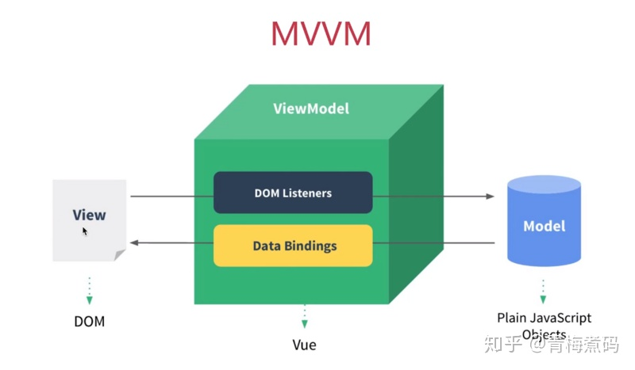
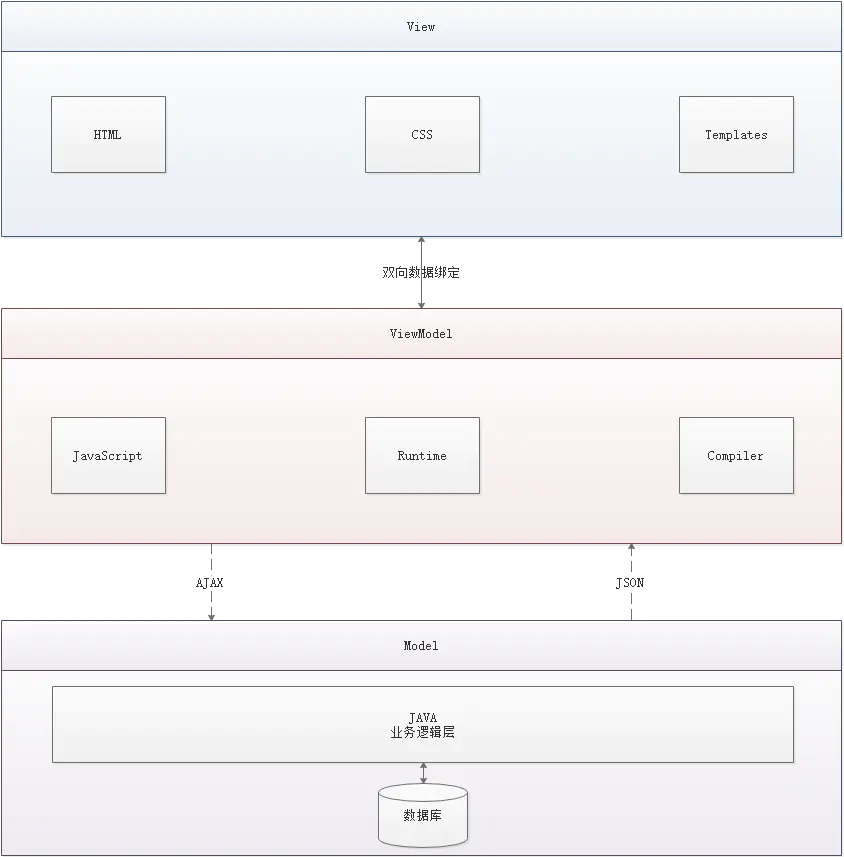
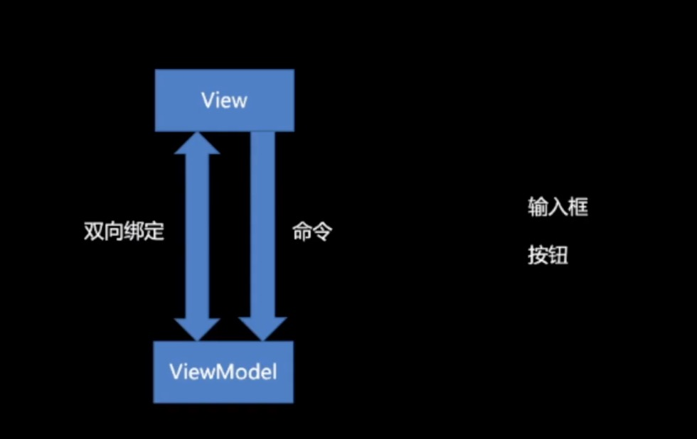

# MVVM
英文：Model-View-ViewModel

## 架构详解
图1

图2

### Model
数据。 JS 对象。（不用关心 View）

### View
视图界面。可以输入并做出反馈（不用关心 Model）

其数据来源是 ViewModel

### ViewModel

* 对获取到的 Model 数据进行转换处理，做二次封装，以生成符合 View 层使用的视图数据层。

* 连接 M 和 V 的桥梁。包括**视图的状态和行为**两部分，
  * 页面的这一块展示什么，那一块展示什么，这些都属于**视图状态**（展示）
  * 页面加载什么，点击之后会发生什么，滚动会发生什么，这些都属于视图行为

实现了双向绑定，ViewModel 的内容会实时展现在 View 层，

### View 和 ViewModel

View 和 ViewModel 的两种交互方式

1. 双向绑定（输入框这种）
2. 命令（按钮）

## 好处

目的是：分离视图（View）和模型（Model）。

* 低耦合：View 可以独立于 Model 变化和修改，一个 ViewModel 可以绑定到不同的 View 上，当 View 变化的时候，Model 可以不变，当 Model 变化的时候 View 也可以不变

* 可复用：可以把一些视图逻辑放在一个 ViewModel 中，可以让很多 View 复用这些逻辑

* 独立开发：开发人员可以专注于业务逻辑和数据的开发（ViewModel），设计人员可以专注于页面设计

* 可测试性：界面素来是比较难以测试的，而现在测试可以针对 ViewModel 来写

  