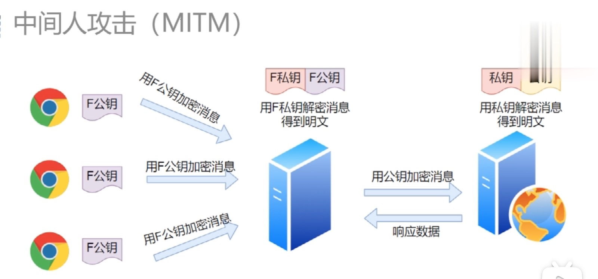

# HTTP 协议基础
HTTP（Hypertext transport protocol）超文本传输协议


## 发展史
### HTTP/0.9
0.9 发布于 1991 年。 规定了 `GET` 获取文件。

* 且只有 `GET`
* 且只有 HTML 文件可以被传送

形式非常简单

```html
<!-- 请求 -->
GET /mypage.html

<!-- 响应 -->
<HTML>
  这是一个 HTML 页面
</HTML>
```


### HTTP/1.0
1.0 发布在 1996 年。
规定了请求头和请求体。
工作模式是这样：

* 建立连接
* 发送请求
* 获得数据
* 断开连接
* ...（重复上面的过程）


### HTTP/1.1
1.1 发布在 1999 年。
新增了 `Connection: keep-alive`。也就是请求完一个数据之后，http 连接是不关闭的，如果还有发往这个服务器的请求，同样的还可以使用这个连接。
也就是 类似下面这两种形式：

*  建立连接 -> 请求数据 -> 请求数据 -> 请求数据 -> 关闭连接

* 也可以这样 同一个服务器建立多个连接，类似于

  ```html
  请求数据 -> 
  请求数据 ->
  请求数据 ->
  ```

  

同一个域名下。最多 6 个 TCP 连接

存在的问题：
1. 明文传输
2. 没有压缩
3. 队头阻塞，类似于必须先下载第一集，才能下载第二集。一个数据包影响了一堆数据包，它不来大家都走不了。
4. header 头太长
5. server 无法主动 push。（可以用 websocket)


### HTTP/2.0

2.0 发布在 2015 年

不再使用明文传输，而是使用二进制。（压缩之后的二进制）
单个连接 + 桢
头部压缩
server 可以主动 push


### HTTP/3.0 

3.0 发布在 2019 年左右


## 前置知识


### 五层网络体系结构模
| 名称       | 关键词                                                       |
| ---------- | ------------------------------------------------------------ |
| 应用层     | HTTP/FTP                                                     |
| 传输层     | TCP/UDP<br />数据的分片和组装                                |
| 网络层     | IP，DNS                                                      |
| 数据链路层 | 在通信的实体间建立数据链路连接<br />物理设备已经通过物理层创建了连接<br />通过软件创建电路的连接用来传输数据(基础的就是 0 1) |
| 物理层     | 定义物理设备如何传输数据，网卡，网线，端口，光缆<br />硬件设备相关的东西 |

> 说明：一次 TCP  连接可以发送一个或者多个 HTTP 请求


### TCP 建立连接的三次握手
三次握手是建立连接的过程


说明：
* SYN 是同步（标志位)，其中 1 为是，0 为否，
* Seq 是序号，数据包本身的序列号
* ACK 是期望对方继续发送的那个数据包的序列号。第三次 Seq = X+1
* ACK 是对收到的数据包的确认，值是等待接收的数据包的序列号。

为什么需要三次握手？
* 防止服务端开启一些无用的连接。
* 如果只有两次握手那么可能因为网络原因客户端没收到，然后客户端就会发送创建新的连接的请求，而这个时候服务端就会再新建一个连接，这就导致了服务端开启了无用的连接
* 维持序列号

 

### TCP 和 UDP 的联系和区别

* TCP 是基于连接的，UDP 是非连接的。

  连接的意思是：传输数据之前源端和终端建立连接

* 对系统的资源要求（TCP 较多，UDP 较少）

* TCP 保证数据正确性，UDP 可能丢包

* TCP 保证数据顺序，UDP 不保证

* UDP 无状态，速度快，UDP 速度慢


### URI 和 URL
* URL：（Uniform Resource Locator）统一资源定位符，身份证号+住址
* URI：统一资源标识符，身份证号码


## HTTP 使用场景
* REST =  HTTP 协议 + json
* API =  HTTP  + json/xml
* webservice =  HTTP 协议 + XML


## 什么是 HTTP 协议
 HTTP 协议就是客户端，服务端按照一定的规则进行交流，客服端按照一定的规则发送请求，服务端按照一定的规则发送响应数据


> 1. 用户输入 url -> 浏览器会经过解析，拿到 url 的 domain 也就是域名 -> 通过 DNS (域名系统)解析之后返回这个 domain 对应的 IP 地址 -> 将 IP 地址和参数写入协议中进行转发到网络层
> 2. 经过局域网、交换机、路由器、主干网络到达服务端
> 3. 服务端是一个 MVC 架构，把我们请求的结果通过 view 层返回到网络层 -> 传输到浏览器
> 4. 浏览器进行 render  (ssr 既是：Server Side Render)


## HTTP 报文格式


在Chrome 中 General 就是起始行


## 请求分为两种
简单请求和非简单请求

什么是简单请求?
1. 请求方法是以下三种方法之一：
   * HEAD
   * GET
   * POST
2. HTTP 的头信息不超出以下几种字段：
   * Accept
   * Accept-Language
   * Content-Language
   * Last-Event-ID
   * Content-Type：只限于三个值`application/x-www-form-urlencoded`、`multipart/form-data`、`text/plain`

**同时满足这两个要求的就是简单请求。**

对于非简单请求，浏览器就会先发送一次预请求，方法是 Options


## 常用请求头	
| <div style='width:180px'>协议头</div>    | 说明           | 示例               |
| --------------------------------------- | --------------- | ---------------- |
| `Cache-Control`      | 是否使用缓存        | Cache-Control:no-cache                      |
| `Origin`             | 发起一个针对[跨域资源共享](http://itbilu.com/javascript/js/VkiXuUcC.html)的请求<br />该请求要求服务器在响应中加入一个`Access-Control-Allow-Origin`的消息头，表示访问控制所允许的来源 | Origin: http://optui.perf.pateo.com.cn           |
| `Cookie`             | cookie信息    | Accept： _bl_uid.....                   |
| `Connection`        | 连接方式    | Connection: keep-alive                 |
| `Accept`             | 可接受的响应内容类型    | Accept: application/json, text/plain            |
| `Accept-Charset`     | 可接受的字符集       | Accept-Charset: utf-8                  |
| `Accept-Encoding `   | 响应内容的编码          | Accept-Encoding：gzip,deflate |
| `Accept-Language`    | 可接受的语言列表       | Accept-Language: zh-CN,zh;q=0.9              |
| `Authorization`      | 权限认证，身份认证信息              | Authorization: beare yJhbGciOiJIU....        |
| `Content-Type`       | 请求体的MIME类型 <br />（用于POST和PUT请求中）        | Content-Type:application/json      |
| `Referer`            | 表示浏览器所访问的前一个页面，可以认为是之前访问页面的链接将浏览器带到了当前页面。`Referer`其实是`Referrer`这个单词，但RFC制作标准时给拼错了，后来也就将错就错使用`Referer`了。 | Referer: http://optui.perf.pateo.com.cn/      |
| `User-Agent`         | 用户代理软件(常用的就是浏览器)的应用类型、操作系统、软件开发商以及版本号。 | Mozilla/5.0 (Windows NT 10.0; Win64; x64) AppleWebKit/537.36 (KHTML, like Gecko) Chrome/74.0.3729.131 Safari/537.36 |


## 常用的响应头
| <div style='width:230px'>响应头</div>  | 说明                          | 示例                                      |
| --------------------------------------| ---------------------------- | ------------------------------------------ |
| `access-control-alow-origin`          | 指定哪些网站可以进行跨域访问      | access-control-allow-origin: http://optui.perf.pateo.com.cn |
| `cache-control`                       | 缓存控制                       | cache-control:no-cache, no-store                            |
| `ETag`                                | 数字签名                       | ETag: "737060cd8c284d8af7a..."                              |
| `Content-type`                        | 当前内容的`MIME`类型            | content-type: application/json                              |
| `Content-Encoding`                    | 响应内容所使用的编码             | Content-Encoding: gzip                                    |
| `Content-Language`                    | 响应内容所使用的语言             | Content-Language: zh-cn                                     |
| `Set-Cookie`                          | 设置 Cookie             | Set-Cookie: UserID=itbilu; Max-Age=3600; Version=1          |


## Referrer Policy
`Referrer-Policy` 的作用就是为了控制请求头中 `referrer`的内容 ，

| <div style='width:230px'>可取的值</div>  | 说明                                             |
| --------------------------------------- | ----------------------------------------------- |
| `no-referrer-when-downgrade`           | 这是默认值。当从 HTTPS 网站跳转到 HTTP 网站或者请求其资源时（安全降级 HTTPS → HTTP ），不显示`referrer`的信息，其他情况（安全同级 HTTPS → HTTP S，或者 HTTP → HTTP ）则在`referrer`中显示完整的源网站的URL信息。 |
| `no-referrer`                           | 不显示`referrer`的任何信息在请求头中                         |
| `same-origin`                           | 表示浏览器只会显示`referrer`信息给同源网站，并且是完整的URL信息。所谓同源网站，是协议、域名、端口都相同的网站。 |
| `origin`                                | 表示浏览器在`referrer`字段中只显示源网站的源地址（即协议、域名、端口），而不包括完整的路径。 |
| `origin-when-cross-origin`              | 当发请求给同源网站时，浏览器会在`referrer`中显示完整的URL信息，发个非同源网站时，则只显示源地址（协议、域名、端口） |


## HTTP 响应状态码
| 类型  | 描述  |
|---|---|
| 1xx  |  服务器收到请求，需要请求者继续执行操作  |
| 2xx  |  成功   |
| 3xx  |  重定向  |
| 4xx  |  客户端错误  |
| 5xx  |  服务端错误  |

常见状态码
| 状态码  | 描述  |
|---|---|
| 204  | 请求处理成功，但是没有任何资源返回到客户端（一般用于只需客户端向服务端发送消息）  |
| 301  | 永久重定向  |
| 302  | 临时重定向，临时的从旧地址 A，跳转到地址 B  |
| 304  | 资源已经找到，但是不满足条件，所以不把资源返回给客户端。自从上次请求后，请求的网页未修改过。常用于协商缓存  |
| 400  | 请求报文内有语法错误  |
| 401  | 未授权。Authorization 字段写上就好 |
| 403  | 访问被拒绝，一般是无权访问，可能是你密码错误  |
| 404  | 服务端找不到请求资源，一般路径错误  |
| 405  | 服务端禁止了使用当前 HTTP 方法的请求。你换个他允许的就可以了。比如把 POST 方法 换成 GET 方法  |
| 413  | Payload 太大，请求主体超过了服务器允许的范围  |
| 414  | URI 太长，超过了服务器允许的范围  |
| 500  | 服务端在处理请求时出现错误  |
| 501  | 请求的方法不被服务器支持。比如服务端就实现了 GET 和 POST 方法，你却用 DELETE 方法请求了  |
| 502  | 错误网关。服务器作为网关或者代理，从上游服务器收到无效响应  |
| 503  | 服务器处于超负载或者停机维护，目前无法提供服务  |
| 504  | 网关超时  |


301 和 302 的区别
```html
301 Moved Permanently 
...
Location:`b.com`
...
// 上述内容表示：亲，您请求的资源已经永久转移啦，这边建议您去新的地址 b.com 访问呢以后也请直接访问新地址哦

```

```html
302 Found
...
Location:`b.com`
...
// 上述内容表示：亲，您请求的资源被临时转移啦，后面也有可能再次转移，所以这边建议您本次去新的地址 b.com 访问，以后的话还是先访问原来地址哦，有任何变化 mm 依然会热心为你解答

```


## 问题

### HTTP 为什么不安全
1. 使用明文通讯，数据没有加密，内容可能被窃听
3. 容易被篡改，没有完整性校验
2. 没有身份验证（这里的身份是指服务端身份）


### HTTPS 为什么安全
逐个击破 HTTP 不安全的点，就可以达到安全的目的，主要有以下优点
* 数据隐私性：内容经过对称加密，每个连接生成一个唯一的加密密钥
* 数据完整性：内容传输经过完整性校验
* 身份认证：第三方无法伪造服务端（客户端）身份

SSL/TLS 协议
SSL(Secure Socket Layer) 安全套接层
又推出了下个版本 ⬇️
TLS(Transport Layer Security) 传输层安全协议

**HTTPS = HTTP + SSL/TLS** 
#### 解决内容可能会窃听的问题 --> 加密
加密有两种方式：对称加密、非对称加密。HTTPS 采用两种方式相结合的方式
也就是：**在交换「协商好的密钥」时，使用非对称加密方式，之后的建立通讯交换报文阶段则使用对称加密方式**


基于 RSA 的 *密钥协商* 的过程
1. 客户端连上服务器；
2. 服务器发送「CA 证书」给客户端；
3. 客户端验证该证书的可靠性；
4. 客户端从「CA 证书」中拿到公钥；
5. 客户端生成一个随机密钥 K，用公钥加密得到 K'
6. 客户端将 K' 发送给服务器；
7. 服务器得到 K' 之后，用自己的私钥解密得到 K；
8. 开始使用 K 进行对称加密的通讯
（基于 RSA 的密钥协商的过程是早期的 SSLv2 使用的一种密钥协商机制；）


#### 解决报文可能被篡改的问题 --> 数字签名 
* 服务端把「内容」经过「hash 函数」生成「摘要」，然后使用私钥对这个「摘要」加密，生成「数字签名」。
* 然后将「内容」和「数字签名」，一起发送给客户端
* 客户端收到「内容」后，取下「数字签名」用公钥解密，得到「内容的摘要」。然后客服端对「内容」使用「hash 函数」，将得到的结果与上面得到的「摘要」，进行对比，如果一致就证明，内容没有被修改。


#### 解决通讯双方身份可能被伪装的问题 --> 数字证书
如何证明客户端拿到的公钥是真的呢？
让大家都认可的权威机构，把我们的公钥盖个章。也即是
* 数字证书：Digital Certificate（公钥盖个章，就得到了数字证书）
* 证书授权中心：Certificate Authority（盖章的）

CA 颁发证书的流程
1. 公司向 CA 提交材料。其中就**包括了公钥**，
2. 经过 CA 盖章（也就是加了 CA 本身的一些信息），就可以颁发给公司了。证书信息包含以下信息：申请者公钥、有效时间等明文，同时还有一个「数字签名」。其中数字签名是这样产生的，首先使用 「hash 函数」对明文信息生成「摘要」，然后 CA 用自己的私钥对摘要进行加密，生成数字签名。
3. 客户端向服务器发送请求时，服务端返回 数字证书。
4. 客户端拿到证书明文信息后，同样采用「hash 函数」生成「内容的摘要」，然后利用 CA 的公钥解密证书里面的数字签名，得到 「摘要」，对比两个摘要，如何相同就证明：**服务端的公钥是值得新来的**
5. 客户端还会验证证书相关的域名信息、有效期等。如果不匹配，那么就报警告

证明证书有效性的证书叫做：**根证书**。这个东西早就在自己电脑的系统里了。


### 什么是对称加密
**对称加密**过程
DES: Data Encryption Standard
1. 定义一个 密钥 key `key = '123456';` 
2. 然后进行加密 `const 密文 = encrypt(需加密的内容，key)`
3. 解密：`const 解密文 = decrypt(已加密的内容，key)`

优点是：
* 加密快

对称加密存在的问题
1. 密钥的私密性问题。密钥怎么传输，才能保证私密
2. 密钥的存储、管理问题。如果有很多网站，客户端不可能保存这么多密钥，服务器也不可能对不同的用户使用相同的密钥，那么如何存储和保存。


### 什么是非对称加密
工作方式如下
1. 生成密钥对 `{publicKey, privateKey}`
2. 公钥加密 `encrypt(需加密内容, publicKey)`
3. 私钥解密 `decrypt(已加密内容, privateKey)`

通信场景示例
1. 客户端访问一个服务端，服务端第一件事情就是下发公钥，（所有用户是同样的）
2. 客户端使用公钥加密消息，服务端收到密文之后，会使用只有自己知道的私钥解密消息

优点是：
* 加密型好

缺点是：
* 加密慢
* 公钥是公开的，那么针对私钥加密的数据，黑客截取后可以使用公钥进行解密，获取其中的内容。
* 公钥本身是公开的，但是在传输的过程中被调包了怎么办，也就是说：服务端本来要给你发送公钥，结果中间被人截胡了，它发送自己的公钥给你，然后你以为是服务端的，然后你开心的开始发送消息，这就导致了你的信息被窃取。这就是**中间人攻击** 

安全的通讯过程
在真正的通讯场景中，会使用对称加密和非对称加密结合的方式


### HTTP 和 HTTPS 的区别？
1. HTTPS 使用了 SSL/TLS 协议，更加安全，HTTP 无安全措施
2. HTTPS 标准端口号为 443，HTTP 端口号为 80；

HTTP 协议采用明文发送，后面为了安全，又增加了 SSL 协议。
SSL 就是一个提供数据安全和完整性的协议。也就是负责网络连接的加密🔐


1. TCP 和 UDP 的区别？
2. HTTP2.0


## 参考
* [数字签名是什么？- 阮一峰](http://www.ruanyifeng.com/blog/2011/08/what_is_a_digital_signature.html)
* [深入理解 HTTPS 工作原理 - 浪里行舟](https://juejin.cn/post/6844903830916694030)