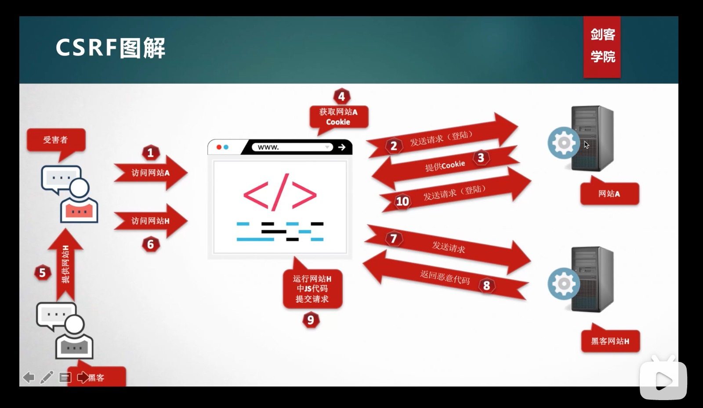

# CSRF
CSRF，即 Cross-Site Request Forgery，中文是：跨站请求伪造。
攻击者在一定的攻击条件下，利用被攻击者的身份，向服务器发起恶意请求，服务器可以正常解析并返回正确结果

下面是攻击流程图

CSRF发生的条件
* 被攻击者在网站 A 处于登陆状态
* 必须在同一浏览器中打开攻击者提供的链接
* 后台身份验证不严格（例如除 cookie 外无其他验证）

## 防范措施

### 验证码
验证码被认为是对抗 CSRF 攻击最简洁而有效的防御方法。
CRSF 攻击往往在用户不知情的情况下构建了网络请求。而验证码会强制用户必须与应用进行交互才能完成最终请求。
但是验证码不能太多，不然用户体验太差，所以只是一种辅助手段

### Referer Check
HTTP 协议中，有个请求头字段为：Referer，它记录了 HTTP 请求的来源地址。我们可以通过检查 Referer 来确保是合法的源
比如：用户要删除自己的帖子，那么先需要登陆 `www.c.com`，然后找到对应的页面发起请求。此时 Referer 为 `www.c.com`；当请求是从别的网址比如：`www.a.com`，这时候我们就可以判断这有可能是一个非法请求。

### 添加 token 验证
我们可以在请求中加入随机的 token ，服务端验证 token 即可。
